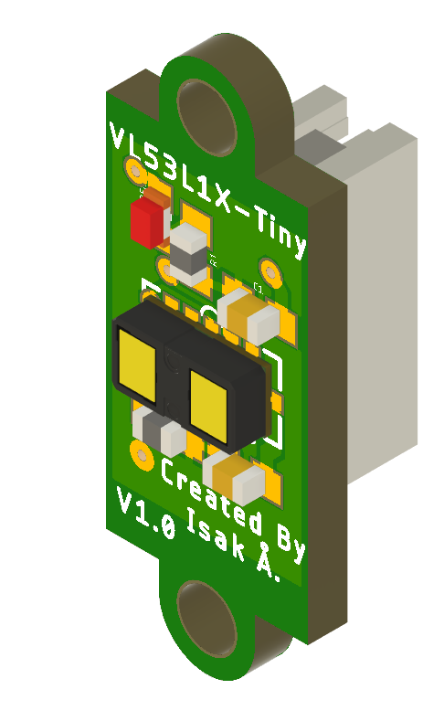
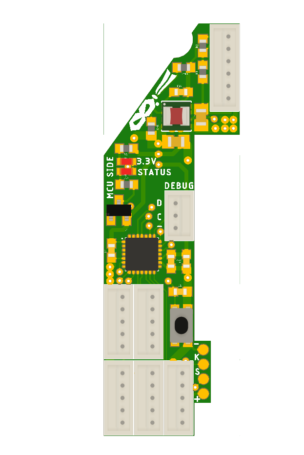
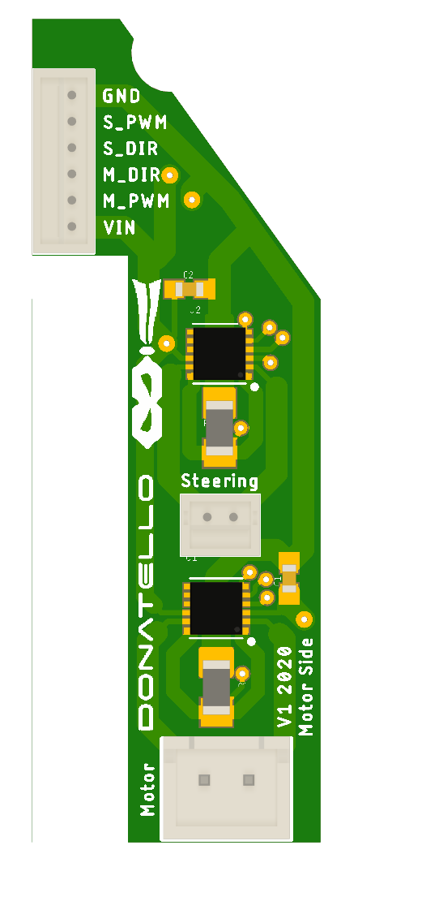

# Donatello Folkrace robot
He look.

He think.

But most importantly

He hack.

# PCB
The robot has 3 different circuitboards:
- 5x Laser sensor boards 
- 1x MCU board
- 1x Motor board
The sensors connects to the MCU board and the MCU board to the motor board.

## Laser sensor board

A tiny pcb with a laser distance sensor (VL53L1X) creating a 2D lidar by fusion data from multiple sensors.
The sensor has a programmable reciever meaning it is possible to get more distance readings from different angles.

The 5 boards create a 135 deg field of view , ~6.5 deg resolution and  20 data points.

## MCU board

It's the brain of the robot and contains a STM32F031G6 Arm Cortex M0 microcontroller. It also has connectors for all sensors, LED, servo feedback connector and voltage regulator.

## Motor board

Contains 2 DC motor drivers (MAX14780) and connector the for battery.

# 3D Scan
Point cloud data of the base car, a Kyosho Mini Z Inferno Buggy.

 
 Post processed 3D Scan with textures.

 
